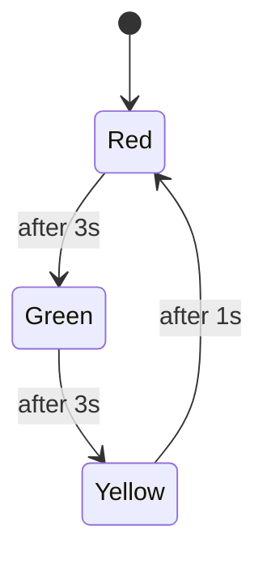
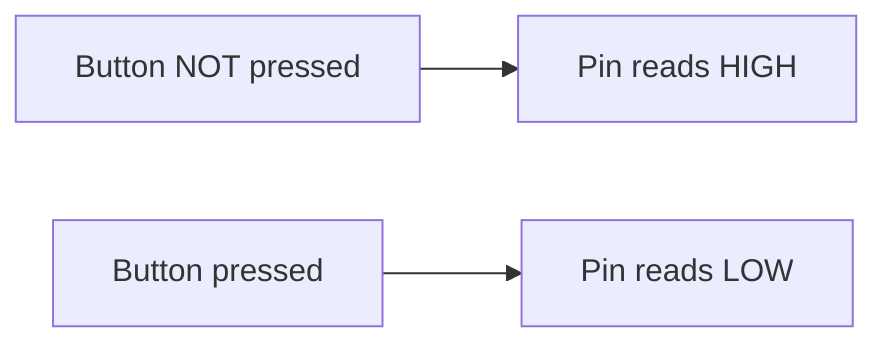
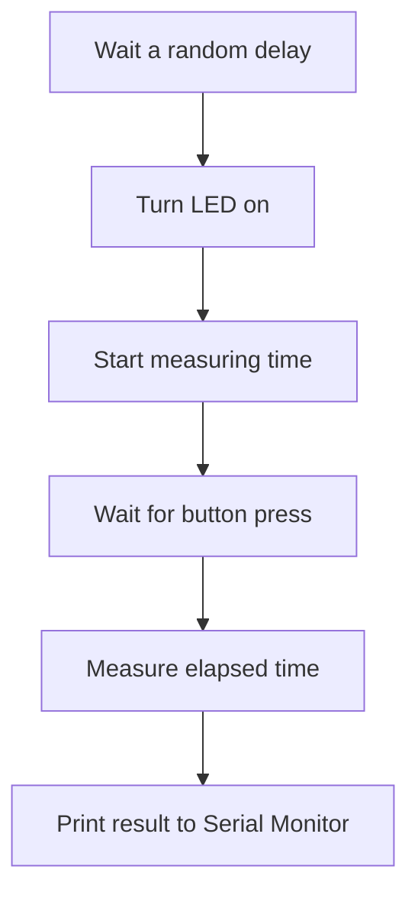

## Overview

Welcome to **Intro To Hardware - Day 1**! 🎉

Today you'll go from "what's a breadboard?" to building a working traffic light — no prior electronics experience needed. We'll cover the fundamentals of circuits, Arduino programming, digital output, digital input, and Pulse Width Modulation (PWM), one small step at a time.

[Download the Intro to Hardware - Day 1 Presentation (PDF)](/files/intro2hardware.pdf)

> 🙋 **New to all this?** That's exactly who this guide is for. Every new term is explained the first time it shows up, every circuit has a diagram, and every task has a stretch goal if you finish early.

### What You'll Need

| Item | Quantity | Notes |
|---|---|---|
| Arduino Uno (or compatible) | 1 | Any Uno-compatible board works |
| USB cable | 1 | To connect board to computer |
| Breadboard | 1 | Half-size or full-size |
| LEDs (red, yellow, green) | 1 each | Any standard 5mm LEDs |
| 220 Ω resistors | 3 | Color bands: red-red-brown-gold |
| Pushbutton | 1 | Standard 4-leg tactile button |
| Jumper wires | ~10 | Male-to-male |
| Arduino IDE | — | [Download here](https://www.arduino.cc/en/software) |

> 💡 **No hardware yet?** No problem — see [Section 6: Simulate Without Hardware](#6-simulate-without-hardware) to build and test every circuit in this guide right in your browser.

### Table of Contents
1. [Anatomy of a Sketch](#1-anatomy-of-a-sketch)
2. [Digital Output](#2-digital-output)
3. [Digital Input](#3-digital-input)
4. [PWM (Pulse Width Modulation)](#4-pwm-pulse-width-modulation)
5. [Mini Challenge Projects](#5-mini-challenge-projects)
6. [Simulate Without Hardware](#6-simulate-without-hardware)
7. [Reference & Further Reading](#7-reference--further-reading)
8. [Troubleshooting Cheat Sheet](#8-troubleshooting-cheat-sheet)

---

## 0. Quick Theory Primer

Before we touch code, let's get three words straight — you'll see them all day.

| Term | What it means | Unit |
|---|---|---|
| **Voltage (V)** | Electrical "pressure" pushing current through a circuit | Volts (V) |
| **Current (I)** | The actual flow of electric charge | Amps (A) |
| **Resistance (R)** | How much a component resists that flow | Ohms (Ω) |

**The water pipe analogy:** think of voltage as water pressure, current as how much water is flowing, and resistance as how narrow the pipe is. Squeeze the pipe (add resistance) and less water flows for the same pressure.

These three are tied together by **Ohm's Law**:

```
V = I × R
```

**Why does this matter for an LED?** An LED has almost no internal resistance. Connect it straight to 5V and it'll try to pull way more current than it can survive — and burn out instantly. A resistor in series limits the current to a safe level.

Quick math for our red LED: it needs about 2V across it and should run at around 15–20 mA (0.015–0.020 A) of current.

```
R = (Supply Voltage − LED Voltage) / Current
R = (5V − 2V) / 0.015A
R ≈ 200 Ω  →  we round up to the nearest standard value: 220 Ω
```

That's the whole reason every LED circuit in this guide has a 220 Ω resistor next to it.

---

## 1. Anatomy of a Sketch

An Arduino program is called a **sketch**. The Arduino IDE requires two primary functions in every sketch:

```cpp
// runs once on power on or reset
void setup() {
  // put your setup code here:
}

// runs forever in a continuous loop
void loop() {
  // put your main code here:
}
```

Here's what actually happens when your board powers on:

```mermaid
flowchart TD
    A["Power On / Reset"] --> B["setup&#40;&#41; runs — ONCE"]
    B --> C["loop&#40;&#41; begins"]
    C --> D["Code inside loop&#40;&#41; runs top to bottom"]
    D --> C
```



`setup()` is where you configure things (like telling a pin it's an output). `loop()` is where the ongoing behavior lives — it repeats forever, as fast as the board can run it, until you unplug it.

---

## 2. Digital Output

### What is Digital Output?
A digital pin acts as a switch controlled by code. It has only two states:
- **HIGH (5V)**
- **LOW (0V)**

Digital pins can be used to control:
- LEDs
- Relays
- Buzzers
- Motors (via a motor driver)

### Breadboard Basics

A breadboard lets you build circuits without soldering. The key thing to know: holes are connected in short vertical columns (the "terminal strips"), and the two outer rows on each side are connected horizontally (the "power rails").

```
   POWER RAIL (+)  ═══════════════════════════════  ← all holes connected
   POWER RAIL (−)  ═══════════════════════════════  ← all holes connected

   a b c d e |gap| f g h i j
   ○ ○ ○ ○ ○ |   | ○ ○ ○ ○ ○     ← row 1 (a-e connected, f-j connected)
   ○ ○ ○ ○ ○ |   | ○ ○ ○ ○ ○     ← row 2 (a-e connected, f-j connected)
   ○ ○ ○ ○ ○ |   | ○ ○ ○ ○ ○     ← row 3 (a-e connected, f-j connected)
        ↑ each column (a-e) is one electrical node
```

> 💡 **Tip:** Plug a component's legs into two *different* columns to connect them through the board — plugging both legs into the *same* column just shorts them together.

### Wiring an LED
When wiring an LED, **don't forget the resistor!** LEDs have very low internal resistance. We use a **220 Ω resistor** to limit the current to a safe level (~15–20 mA), as calculated above.

```
Arduino Pin 8 ──── [ 220 Ω resistor ] ──── ▶|── LED ──── GND
                                          anode  cathode
                                       (long leg) (short leg,
                                                   flat edge)
```

*Diagram Tip: Connect the long leg (anode) of the LED to a digital pin through the resistor, and the short leg (cathode) to GND (ground). LEDs only work one way — if it doesn't light up, try flipping it around.*

### Core Functions

#### `pinMode()`
Tells the Arduino how a specific pin should behave. This must be set inside the `setup()` function.
```cpp
pinMode(8, OUTPUT); // Tells the Arduino: "this pin will send signals out"
```
📚 [Reference: pinMode()](https://docs.arduino.cc/language-reference/en/functions/digital-io/pinMode/)

#### `digitalWrite()`
Sets a digital pin's voltage to HIGH (5V) or LOW (0V).
```cpp
digitalWrite(8, HIGH); // turn ON
digitalWrite(8, LOW);  // turn OFF
```
📚 [Reference: digitalWrite()](https://docs.arduino.cc/language-reference/en/functions/digital-io/digitalWrite/)

#### `delay()`
Pauses the program for a given time in milliseconds. Note that nothing else happens on the board while `delay()` is running.
```cpp
delay(1000); // pause for 1000 milliseconds = 1 second
```
📚 [Reference: delay()](https://docs.arduino.cc/language-reference/en/functions/time/delay/)

### Full Blink Code Walkthrough
```cpp
int ledPin = 8; // A variable to store our pin number

void setup() {
  pinMode(ledPin, OUTPUT);
}

void loop() {
  digitalWrite(ledPin, HIGH); // Turn LED on
  delay(1000);                // Wait 1 second
  digitalWrite(ledPin, LOW);  // Turn LED off
  delay(1000);                // Wait 1 second
}
```

### Variables in Arduino
A variable is a named "box" that stores a value. Using variables instead of raw numbers makes your code easier to read and change.
```cpp
int ledPin = 8;         // whole numbers
bool isOn = true;       // true/false
long delayTime = 500;   // larger numbers
```

### ✅ Task 1: Build & Upload Blink
⏱ ~15 minutes

- [ ] Wire the LED circuit as shown in the diagram above (pin 8 → resistor → LED → GND)
- [ ] Open the Arduino IDE and paste in the Blink code
- [ ] Select your board and port under **Tools**
- [ ] Click **Upload**
- [ ] Confirm the LED blinks once per second

**Stretch Goals:**
- Make it blink twice as fast.
- Blink an SOS-like pattern manually (no loop).

---

### Traffic Light System

Different ON/OFF durations create different "feels": fast = urgent, slow = calm. Sequencing multiple `digitalWrite` and `delay` pairs creates a pattern. A traffic light is exactly that: a fixed sequence of timed states.



**Circuit Diagram:**
```
 Pin 8 ──[220Ω]──▶|── RED LED ────┐
 Pin 9 ──[220Ω]──▶|── YELLOW LED ─┼──── GND (shared rail)
 Pin 10 ─[220Ω]──▶|── GREEN LED ──┘
```
- Red LED → pin 8 (+ 220Ω resistor) → GND
- Yellow LED → pin 9 (+ 220Ω resistor) → GND
- Green LED → pin 10 (+ 220Ω resistor) → GND

**Code Hints:**
```cpp
int red = 8, yellow = 9, green = 10;

void setup() {
  pinMode(red, OUTPUT);
  pinMode(yellow, OUTPUT);
  pinMode(green, OUTPUT);
}

void loop() {
  // your sequence here:
  // red on -> wait -> red off, green on -> wait -> ...
}
```
*Think about what needs to turn OFF before the next color turns ON.*

<details>
<summary>🔓 Stuck? Click to reveal one working solution</summary>

```cpp
int red = 8, yellow = 9, green = 10;

void setup() {
  pinMode(red, OUTPUT);
  pinMode(yellow, OUTPUT);
  pinMode(green, OUTPUT);
}

void loop() {
  digitalWrite(red, HIGH);
  delay(3000);
  digitalWrite(red, LOW);

  digitalWrite(green, HIGH);
  delay(3000);
  digitalWrite(green, LOW);

  digitalWrite(yellow, HIGH);
  delay(1000);
  digitalWrite(yellow, LOW);
}
```
Try to get your own version working before peeking — you'll remember it better!
</details>

### ✅ Task 2 & 3: Build the Traffic Light
⏱ ~20 minutes

- [ ] Wire all three LEDs with their own 220Ω resistors
- [ ] Write the sequence: Red → Green → Yellow → Red…
- [ ] Suggested timing: Red 3s, Green 3s, Yellow 1s
- [ ] Upload and confirm the cycle repeats correctly

**Stretch Goals:**
- Add a "blinking yellow" caution mode before switching to red.

### 🧠 Quick Check
<details>
<summary>Why does the LED need a resistor, but a relay or motor driver module usually doesn't?</summary>

An LED is a simple diode with almost no internal resistance, so it can't limit its own current — you must add a resistor, or it draws too much and burns out. Relays and motor driver modules have their own internal current-limiting/protection circuitry built in, so they don't need an external series resistor the way a bare LED does.
</details>

---

## 3. Digital Input

### What is Digital Input?
Instead of sending a signal, the Arduino now reads one. A digital input pin reports `HIGH` or `LOW` based on an external signal, like a button press. Real-world examples include door sensors, keypad buttons, and limit switches.

### Push Button Circuit
```
        Pin 2 ─────┬───── [ BUTTON ] ───── GND
                    │
        (internal pull-up resistor
         connects this pin to 5V
         when nothing else is pulling it down)
```
- Button across two breadboard rows.
- One leg → Arduino digital pin (e.g. pin 2).
- Other leg → GND.
- **No external resistor needed** because we use the internal pull-up!

### The Internal Pull-Up Resistor
**Problem:** an unconnected ("floating") input pin reads random noise — it isn't reliably HIGH or LOW, it just picks up whatever electrical interference is nearby.

**Solution:** `INPUT_PULLUP` connects an internal resistor to 5V by default, so the pin has a stable, known value when the button isn't pressed.

**Result:** `HIGH` when not pressed, `LOW` when pressed — **inverted logic!**
```cpp
pinMode(2, INPUT_PULLUP);
```



### Function: `digitalRead()`
Reads the current `HIGH` or `LOW` value of a digital pin. Store the result in a variable to use in an `if` statement.
```cpp
int state = digitalRead(2);
if (state == LOW) {
  // button is being pressed
}
```
📚 [Reference: digitalRead()](https://docs.arduino.cc/language-reference/en/functions/digital-io/digitalRead/)

### Button-Controlled LED — Full Code
```cpp
int buttonPin = 2;
int ledPin = 8;

void setup() {
  pinMode(buttonPin, INPUT_PULLUP);
  pinMode(ledPin, OUTPUT);
}

void loop() {
  int state = digitalRead(buttonPin);
  if (state == LOW) {
    digitalWrite(ledPin, HIGH); // Button pressed, LED ON
  } else {
    digitalWrite(ledPin, LOW);  // Button released, LED OFF
  }
}
```

### ✅ Task 4: Build the Button-Controlled LED
⏱ ~15 minutes

- [ ] Wire the button to pin 2 and GND (no resistor needed)
- [ ] Wire the LED to pin 8 as before
- [ ] Upload the code above
- [ ] Confirm the LED lights only while the button is held down

**Stretch Goal:**
- Make the button toggle the LED — stays on after release, turns off on next press. *(Hint: you'll need a variable that remembers the LED's state between loops, and logic that only reacts to a fresh press, not a held-down button.)*

### 🧠 Quick Check
<details>
<summary>If you forget INPUT_PULLUP and leave the pin floating, what would you expect to see?</summary>

The LED would flicker or behave erratically even when nobody touches the button — the pin has no defined HIGH or LOW state, so it picks up random electrical noise and digitalRead() returns unpredictable values.
</details>

---

## 4. PWM (Pulse Width Modulation)

### What is PWM?
Digital pins can only be fully ON or fully OFF, but switching ON/OFF very fast can simulate "in-between" brightness. The ratio of ON-time to OFF-time is called the **duty cycle**.

```
25% duty cycle:  ▓░░░ ▓░░░ ▓░░░   (dim)
50% duty cycle:  ▓▓░░ ▓▓░░ ▓▓░░   (medium)
75% duty cycle:  ▓▓▓░ ▓▓▓░ ▓▓▓░   (bright)
     ▓ = ON   ░ = OFF
```

The switching happens hundreds of times per second — far too fast for your eye to see the flicker, so it just looks like a steady brightness in between fully on and fully off.

**PWM vs. True Analog Output:**
- True analog is a continuously variable voltage (Arduino Uno cannot output this directly on digital pins).
- PWM is still just HIGH/LOW, but rapidly switched to appear variable.
- Uno PWM pins are marked with a `~` symbol (e.g., pins 3, 5, 6, 9, 10, 11).

### Function: `analogWrite()`
Must be used on a `~` PWM pin.
```cpp
analogWrite(9, 128); // value from 0 (off) to 255 (full brightness)
```
- `0` = always off
- `255` = always on
- `128` ≈ 50% brightness

📚 [Reference: analogWrite()](https://docs.arduino.cc/language-reference/en/functions/analog-io/analogWrite/)

### Fade LED — Circuit & Code
Use the same circuit as the single Blink LED, but connect it to a `~` pin (e.g. pin 9).

```cpp
int brightness = 0;

void setup() {
  pinMode(9, OUTPUT);
}

void loop() {
  analogWrite(9, brightness);
  brightness = brightness + 5;
  
  if (brightness > 255) {
    brightness = 0;
  }
  
  delay(30); // 30 millisecond pause 
}
```

### ✅ Task 5: Build the Fade LED
⏱ ~15 minutes

- [ ] Move the LED circuit to a `~` PWM pin (e.g. pin 9)
- [ ] Upload the fade code
- [ ] Confirm the LED smoothly ramps up, then snaps back to 0 and repeats

**Stretch Goal:**
- Make it fade up and down smoothly, with no snap reset (needs a direction flag).

### 🧠 Quick Check
<details>
<summary>Why does the fade code snap back to 0 instead of fading down again?</summary>

`brightness` only ever increases by 5 each loop, and the `if` statement just resets it to 0 once it passes 255 — there's no logic that ever decreases it. To fade back down smoothly, you'd need a variable (a "direction flag") that flips between adding and subtracting once brightness hits either end (0 or 255).
</details>

---

## 5. Mini Challenge Projects

Pick one of the following to build with your group!

### Option 1: Night Lamp
- Reuse the Fade LED circuit and code.
- Add a button to turn the "lamp" on/off entirely.
- Slower fade-in speed feels more "lamp-like" when the button is pushed.

### Option 2: Blink Patterns
- Use multiple `digitalWrite` + `delay` calls in sequence to design a pattern.
- Ideas: heartbeat (short-short-pause), emergency flash, countdown blink.

### Option 3: Reaction Timer
Introduces `random()` and optionally `millis()` for timing. Needs `Serial.begin()` / `Serial.println()` to show the result.



```cpp
// Rough logic outline:
// 1. Wait a random delay (delay + random())
// 2. Turn LED on
// 3. Start measuring time
// 4. Wait for button press
// 5. Measure elapsed time -> print to Serial Monitor
```

### Option 4: Morse Code LED
- Dot = short blink (~200 ms), Dash = long blink (~600 ms).
- Gap between symbols, longer gap between letters.
- Encode a short word — your name, or "HI".

**Morse Code Reference (A–Z):**

| A | .- | J | .--- | S | ... |
|---|---|---|---|---|---|
| B | -... | K | -.- | T | - |
| C | -.-. | L | .-.. | U | ..- |
| D | -.. | M | -- | V | ...- |
| E | . | N | -. | W | .-- |
| F | ..-. | O | --- | X | -..- |
| G | --. | P | .--. | Y | -.-- |
| H | .... | Q | --.- | Z | --.. |
| I | .. | R | .-. | | |

Example: "HI" = `....` `..` (dot-dot-dot-dot, gap, dot-dot)

---

## 6. Simulate Without Hardware

Don't have the parts yet, or want to test your code before wiring anything? These tools let you build and run every circuit in this guide right in your browser.

| Tool | Best for | Link |
|---|---|---|
| **Tinkercad Circuits** | Beginners — drag-and-drop parts, built-in Arduino code editor, great for Blink/Traffic Light/Button tasks | [tinkercad.com/circuits](https://www.tinkercad.com/circuits) |
| **Wokwi** | Fast, realistic simulation with a proper code editor and serial monitor; easy to share a project link with your group | [wokwi.com](https://wokwi.com/) |
| **SimulIDE** | An offline desktop simulator if you want realistic simulation without needing a browser/internet | [simulide.com](https://simulide.com/) |
| **Falstad Circuit Simulator** | Understanding pure electronics concepts (Ohm's Law, resistor behavior) without any microcontroller involved | [falstad.com/circuit](https://www.falstad.com/circuit/) |

> 💡 **Suggested workflow:** Build and test your circuit in Tinkercad or Wokwi first. Once it behaves the way you want, wire up the real hardware and upload the same code — you'll spend less time debugging wiring issues on the real board.

---

## 7. Reference & Further Reading

- [Arduino Language Reference (all functions)](https://docs.arduino.cc/language-reference/)
- [pinMode()](https://docs.arduino.cc/language-reference/en/functions/digital-io/pinMode/)
- [digitalWrite()](https://docs.arduino.cc/language-reference/en/functions/digital-io/digitalWrite/)
- [digitalRead()](https://docs.arduino.cc/language-reference/en/functions/digital-io/digitalRead/)
- [analogWrite() / PWM](https://docs.arduino.cc/language-reference/en/functions/analog-io/analogWrite/)
- [delay()](https://docs.arduino.cc/language-reference/en/functions/time/delay/)
- [Download the Arduino IDE](https://www.arduino.cc/en/software)

---

## 8. Troubleshooting Cheat Sheet

| Symptom | Likely Cause |
|---|---|
| LED doesn't light at all | LED is backwards (flip it), or the circuit isn't complete — check GND is actually connected |
| LED is always dim / very faint | Wrong pin selected in code vs. wiring, or a loose jumper wire |
| Upload fails / board not found | Wrong board or port selected under **Tools** in the IDE; try a different USB cable/port |
| Button always reads pressed (or never does) | Forgot `INPUT_PULLUP`, or the button legs aren't bridging the gap in the breadboard correctly |
| Traffic light LEDs overlap / stay on together | Missing a `digitalWrite(..., LOW)` before turning the next color on |
| Fade LED doesn't fade, just blinks | Connected to a non-PWM pin — PWM pins are marked with `~` |

---

## Summary
Today we covered:
- **Circuit theory basics:** voltage, current, resistance, Ohm's Law
- **Digital output:** `pinMode`, `digitalWrite`, `delay`
- **Digital input:** `digitalRead`, `INPUT_PULLUP`
- **PWM:** `analogWrite`, duty cycle
- **Projects Built:** Blink, Traffic Light, Button LED, Fade LED, + a mini project!
- **Where to practice:** Tinkercad, Wokwi, SimulIDE, and Falstad for simulation

Great work getting through Day 1 — every embedded systems project you'll ever build starts with exactly these building blocks. 🎉