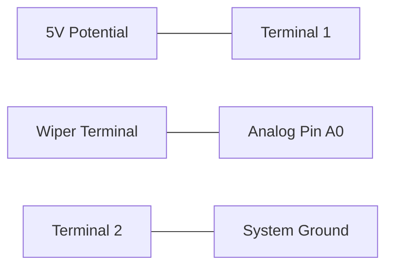

## 3. Analog Input: Potentiometer

### Principles of Variable Resistance
A potentiometer functions as an adjustable voltage divider. Actuation of the mechanical wiper alters the resistance ratio between the central terminal and the external terminals, subsequently modulating the output voltage.

### Circuit Implementation


- Pin 1 -> 5V Logic Level
- Pin 2 -> System Ground (GND)
- Wiper (Center Pin) -> Analog Input A0

### Standard Library Functions

#### `analogRead()`
Reads the continuous voltage applied to an analog pin and performs a 10-bit conversion.
```cpp
int value = analogRead(A0);
```
- Converts 0V – 5V input to an integer representation from 0 to 1023.
📚 [Reference: analogRead()](https://docs.arduino.cc/language-reference/en/functions/analog-io/analogRead/)

#### `map()`
Performs a linear interpolation to scale a value from one defined range to another.
```cpp
int brightness = map(value, 0, 1023, 0, 255);
```
- Proposes a proportional mapping from the 10-bit ADC resolution (0–1023) to the 8-bit PWM resolution (0–255).
📚 [Reference: map()](https://docs.arduino.cc/language-reference/en/functions/math/map/)

### Data Acquisition and Diagnostic Output
Before integrating output actuation, verify the data stream via the Serial Monitor.

```cpp
int potPin = A0;

void setup() {
  Serial.begin(9600);
}

void loop() {
  int value = analogRead(potPin);
  Serial.println(value);
  delay(100); // 100-millisecond execution suspension
}
```

### Continuous Variable Control Implementation
```cpp
int potPin = A0;
int ledPin = 9; // Requires PWM capability (~)

void setup() {
  pinMode(ledPin, OUTPUT);
  Serial.begin(9600);
}

void loop() {
  int value = analogRead(potPin);
  int brightness = map(value, 0, 1023, 0, 255);
  analogWrite(ledPin, brightness);
  
  Serial.print("Raw ADC: ");
  Serial.print(value);
  Serial.print(" | Scaled PWM: ");
  Serial.println(brightness);
}
```
This architecture—**Data Acquisition -> Data Normalization -> Output Actuation**—forms the foundation of closed-loop control systems.

### Task 1: Analog Illumination Control
**Estimated Duration:** ~15 minutes

- [ ] Construct the potentiometer voltage divider circuit connecting the wiper to A0.
- [ ] Implement an LED on PWM-capable Pin 9.
- [ ] Compile and deploy the variable control program.
- [ ] Verify linear adjustment of LED luminosity correlated to mechanical rotation of the potentiometer.
- [ ] Monitor the Serial interface for corresponding numerical output.
