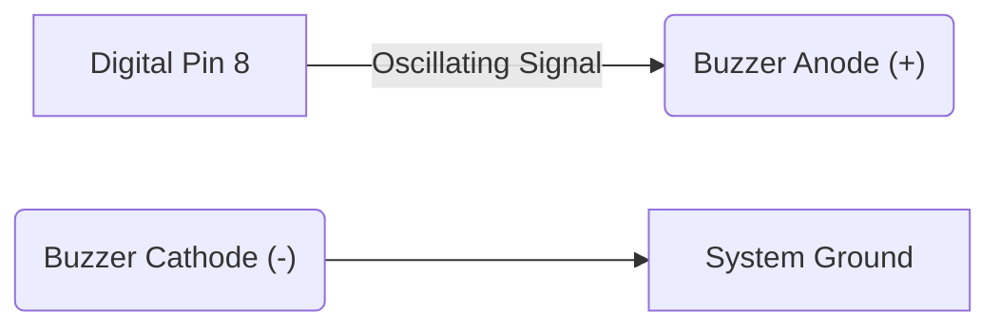

## 4. Acoustic Output: Piezoelectric Transducers

### Principles of Acoustic Generation
A piezoelectric buzzer converts an oscillating electrical signal into a mechanical vibration, generating an acoustic wave. The frequency of the applied signal directly dictates the pitch of the resulting tone.

### Circuit Implementation


### Standard Library Functions

#### `tone()` and `noTone()`
```cpp
tone(8, 440); // Pin 8, Frequency: 440 Hz (Standard A4 note)
delay(1000);
noTone(8);    // Disengage oscillation
```
- `tone()` generates a square wave of the specified frequency.
- `noTone()` terminates the waveform generation.
📚 [Reference: tone()](https://docs.arduino.cc/language-reference/en/functions/advanced-io/tone/)

### Sequential Frequency Generation (Melody)
```cpp
int frequencies[] = {262, 294, 330, 349, 392}; // C4, D4, E4, F4, G4
int duration = 300;

void setup() {
  for (int i = 0; i < 5; i++) {
    tone(8, frequencies[i]);
    delay(duration);
    noTone(8);
    delay(50); // Inter-tone temporal gap
  }
}

void loop() {
  // Execution terminates after single sequence
}
```

<details>
<summary>Alternative Implementation: Sweeping Frequency Oscillation (Siren)</summary>

To implement an alert siren utilizing a continuous frequency sweep:

```cpp
void loop() {
  // Ascending frequency sweep
  for (int freq = 400; freq <= 1200; freq += 20) {
    tone(8, freq);
    delay(5);
  }
  // Descending frequency sweep
  for (int freq = 1200; freq >= 400; freq -= 20) {
    tone(8, freq);
    delay(5);
  }
}
```
</details>

### Task 2: Acoustic Generation
**Estimated Duration:** ~15 minutes

- [ ] Connect the piezoelectric buzzer between Pin 8 and ground.
- [ ] Compile and deploy the frequency sequence (melody or sweep).
- [ ] Verify acoustic output and spectral variance.
