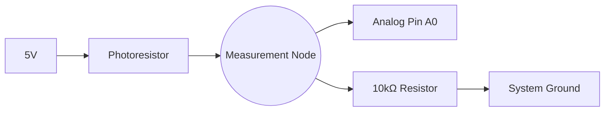

## 5. Environmental Sensing Architecture

### Principles of Data Acquisition
A transducer converts a physical property (luminosity, spatial distance, thermal energy) into a measurable electrical characteristic. The processing unit acquires this data, evaluates conditional boundaries, and triggers output states.


### Sensor Integration Selection
Implement the appropriate protocol based on the provided hardware configuration.

#### Option A: Photoresistor (LDR) Voltage Divider
**Theoretical Operation:** A Light Dependent Resistor (LDR) modifies its internal resistance inversely proportional to incident light intensity. By configuring a voltage divider with a static 10kΩ resistor, the fluctuating resistance is translated into a variable voltage measurable by the ADC.



#### Option B: Ultrasonic Distance Measurement (HC-SR04)
**Theoretical Operation:** The HC-SR04 emits a 40 kHz acoustic pulse and monitors for a reflected waveform. Distance is calculated utilizing the time-of-flight of the acoustic wave and the speed of sound.

```cpp
#define trigPin 9
#define echoPin 10

void setup() {
  Serial.begin(9600);
  pinMode(trigPin, OUTPUT);
  pinMode(echoPin, INPUT);
}

void loop() {
  // Initiate acoustic pulse
  digitalWrite(trigPin, LOW);
  delayMicroseconds(2);
  digitalWrite(trigPin, HIGH);
  delayMicroseconds(10);
  digitalWrite(trigPin, LOW);

  // Measure echo duration and calculate distance
  long duration = pulseIn(echoPin, HIGH);
  float distanceCm = duration * 0.034 / 2;
  
  Serial.println(distanceCm);
  delay(200);
}
```
📚 [Reference: pulseIn()](https://docs.arduino.cc/language-reference/en/functions/advanced-io/pulseIn/)

#### Option C: Digital Temperature & Humidity Sensing (DHT11)
**Theoretical Operation:** The DHT11 utilizes a proprietary single-wire digital protocol for data transmission. Software implementation requires an external dependency library to parse the serial bitstream.

- **Dependency Requirement:** Install "DHT sensor library" via the IDE Library Manager.

```cpp
#include <DHT.h>
#define dhtPin 2
DHT dht(dhtPin, DHT11);

void setup() {
  Serial.begin(9600);
  dht.begin();
}

void loop() {
  float temp = dht.readTemperature();
  float humidity = dht.readHumidity();
  
  if (isnan(temp) || isnan(humidity)) {
    Serial.println("Diagnostic Error: Invalid DHT11 Checksum");
    return;
  }
  
  Serial.print("Temperature: ");
  Serial.print(temp);
  Serial.print(" C | Humidity: ");
  Serial.println(humidity);
  delay(1000);
}
```
📚 [DHT Sensor Library Specification](https://docs.arduino.cc/libraries/dht-sensor-library/)

### Task 3: Environmental Data Acquisition
**Estimated Duration:** ~20 minutes

- [ ] Select and wire the designated transducer.
- [ ] Compile and deploy the corresponding data acquisition script.
- [ ] Utilize the Serial Monitor to verify data stream integrity.
