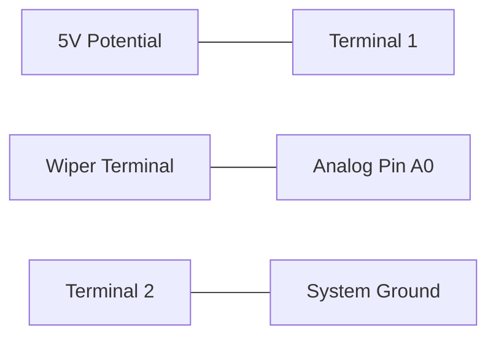
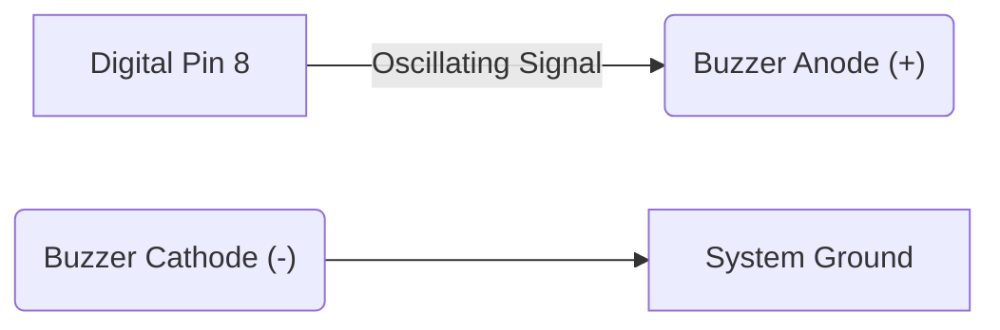
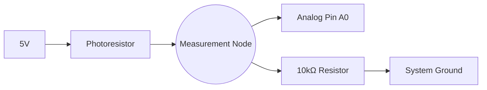

## 1. Introduction

This module builds upon the foundational concepts of microcontroller programming, focusing on analog signal processing, environmental sensing, and acoustic output generation. By the culmination of this session, students will utilize transducers and logic systems to construct responsive hardware architectures.

[Download the Introduction to Hardware Day 2 Presentation (PDF)](#)

**Target Audience:** This guide assumes mastery of digital I/O and Pulse Width Modulation (PWM) as detailed in the previous module. 

### Required Components

| Item | Quantity | Notes |
|---|---|---|
| Arduino Uno (or compatible) | 1 | Microcontroller board |
| USB cable | 1 | Communication interface |
| Breadboard & Jumper wires | - | Prototyping apparatus |
| Potentiometer | 1 | 10kΩ variable resistor |
| Passive Buzzer | 1 | Acoustic transducer |
| LED & 220Ω resistor | 1 | Standard 5mm Light Emitting Diode |
| Pushbutton | 1 | Standard tactile switch |
| Sensor Kit (LDR, HC-SR04, or DHT11) | 1 | Environmental transducer |

**Note on Simulation:** For students without physical hardware, refer to [Section 7: Simulation Tools](#7-simulation-tools) to model and execute all circuits virtually.

### Contents
1. [Theoretical Foundations: Digital vs. Analog](#1-theoretical-foundations-digital-vs-analog)
2. [Diagnostic Interfaces: Serial Communication](#2-diagnostic-interfaces-serial-communication)
3. [Analog Input: Potentiometer](#3-analog-input-potentiometer)
4. [Acoustic Output: Piezoelectric Transducers](#4-acoustic-output-piezoelectric-transducers)
5. [Environmental Sensing Architecture](#5-environmental-sensing-architecture)
6. [Extended Implementation Projects](#6-extended-implementation-projects)
7. [Simulation Tools](#7-simulation-tools)
8. [Reference Material](#8-reference-material)
9. [Hardware Diagnostic Matrix](#9-hardware-diagnostic-matrix)

---

## 1. Theoretical Foundations: Digital vs. Analog

| Parameter | Digital Logic | Analog Signal |
|---|---|---|
| **State Resolution** | Discrete binary states (HIGH / LOW) | Continuous variable potential |
| **System Implementations** | Actuation, tactile input, basic timing | Environmental sensing, variable control |
| **Standard Interfaces** | `digitalWrite()`, `digitalRead()` | `analogRead()`, `analogWrite()` (PWM) |

While Pulse Width Modulation (PWM) approximates variable output via rapid digital oscillation, analog input facilitates the measurement of continuous electrical potentials derived from external physical phenomena.

### Microcontroller Pin Architecture

| Interface | Operational Behavior |
|---|---|
| Digital I/O (Pins 0–13) | Binary logic states; `~` denotes hardware PWM capability |
| Analog Input (Pins A0–A5) | 10-bit Analog-to-Digital Conversion (ADC) |

*Note: Analog pins are dedicated to continuous signal measurement via `analogRead()` and function differently from standard digital I/O.*

---

## 2. Diagnostic Interfaces: Serial Communication

Environmental transducers output continuous numerical data. The **Serial Monitor** provides a diagnostic interface to observe these numerical values prior to implementing conditional logic based upon them.

```cpp
void setup() {
  Serial.begin(9600); // Initialize communication at 9600 baud
}

void loop() {
  Serial.println("System Initialization Complete.");
}
```

- `Serial.begin(9600)` establishes a Universal Asynchronous Receiver-Transmitter (UART) connection at a rate of 9600 bits per second.
- `Serial.println()` transmits data strings or variable values to the diagnostic console, appending a carriage return.

📚 [Reference: Serial Communication](https://docs.arduino.cc/language-reference/en/functions/communication/serial/)

**Methodological Recommendation:** Always output raw sensor data to the Serial Monitor to verify transducer integrity before utilizing the data within conditional logic structures.

---

## 3. Analog Input: Potentiometer

### Principles of Variable Resistance
A potentiometer functions as an adjustable voltage divider. Actuation of the mechanical wiper alters the resistance ratio between the central terminal and the external terminals, subsequently modulating the output voltage.

### Circuit Implementation


- Pin 1 -> 5V Logic Level
- Pin 2 -> System Ground (GND)
- Wiper (Center Pin) -> Analog Input A0

### Standard Library Functions

#### `analogRead()`
Reads the continuous voltage applied to an analog pin and performs a 10-bit conversion.
```cpp
int value = analogRead(A0);
```
- Converts 0V – 5V input to an integer representation from 0 to 1023.
📚 [Reference: analogRead()](https://docs.arduino.cc/language-reference/en/functions/analog-io/analogRead/)

#### `map()`
Performs a linear interpolation to scale a value from one defined range to another.
```cpp
int brightness = map(value, 0, 1023, 0, 255);
```
- Proposes a proportional mapping from the 10-bit ADC resolution (0–1023) to the 8-bit PWM resolution (0–255).
📚 [Reference: map()](https://docs.arduino.cc/language-reference/en/functions/math/map/)

### Data Acquisition and Diagnostic Output
Before integrating output actuation, verify the data stream via the Serial Monitor.

```cpp
int potPin = A0;

void setup() {
  Serial.begin(9600);
}

void loop() {
  int value = analogRead(potPin);
  Serial.println(value);
  delay(100); // 100-millisecond execution suspension
}
```

### Continuous Variable Control Implementation
```cpp
int potPin = A0;
int ledPin = 9; // Requires PWM capability (~)

void setup() {
  pinMode(ledPin, OUTPUT);
  Serial.begin(9600);
}

void loop() {
  int value = analogRead(potPin);
  int brightness = map(value, 0, 1023, 0, 255);
  analogWrite(ledPin, brightness);
  
  Serial.print("Raw ADC: ");
  Serial.print(value);
  Serial.print(" | Scaled PWM: ");
  Serial.println(brightness);
}
```
This architecture—**Data Acquisition -> Data Normalization -> Output Actuation**—forms the foundation of closed-loop control systems.

### Task 1: Analog Illumination Control
**Estimated Duration:** ~15 minutes

- [ ] Construct the potentiometer voltage divider circuit connecting the wiper to A0.
- [ ] Implement an LED on PWM-capable Pin 9.
- [ ] Compile and deploy the variable control program.
- [ ] Verify linear adjustment of LED luminosity correlated to mechanical rotation of the potentiometer.
- [ ] Monitor the Serial interface for corresponding numerical output.

---

## 4. Acoustic Output: Piezoelectric Transducers

### Principles of Acoustic Generation
A piezoelectric buzzer converts an oscillating electrical signal into a mechanical vibration, generating an acoustic wave. The frequency of the applied signal directly dictates the pitch of the resulting tone.

### Circuit Implementation


### Standard Library Functions

#### `tone()` and `noTone()`
```cpp
tone(8, 440); // Pin 8, Frequency: 440 Hz (Standard A4 note)
delay(1000);
noTone(8);    // Disengage oscillation
```
- `tone()` generates a square wave of the specified frequency.
- `noTone()` terminates the waveform generation.
📚 [Reference: tone()](https://docs.arduino.cc/language-reference/en/functions/advanced-io/tone/)

### Sequential Frequency Generation (Melody)
```cpp
int frequencies[] = {262, 294, 330, 349, 392}; // C4, D4, E4, F4, G4
int duration = 300;

void setup() {
  for (int i = 0; i < 5; i++) {
    tone(8, frequencies[i]);
    delay(duration);
    noTone(8);
    delay(50); // Inter-tone temporal gap
  }
}

void loop() {
  // Execution terminates after single sequence
}
```

<details>
<summary>Alternative Implementation: Sweeping Frequency Oscillation (Siren)</summary>

To implement an alert siren utilizing a continuous frequency sweep:

```cpp
void loop() {
  // Ascending frequency sweep
  for (int freq = 400; freq <= 1200; freq += 20) {
    tone(8, freq);
    delay(5);
  }
  // Descending frequency sweep
  for (int freq = 1200; freq >= 400; freq -= 20) {
    tone(8, freq);
    delay(5);
  }
}
```
</details>

### Task 2: Acoustic Generation
**Estimated Duration:** ~15 minutes

- [ ] Connect the piezoelectric buzzer between Pin 8 and ground.
- [ ] Compile and deploy the frequency sequence (melody or sweep).
- [ ] Verify acoustic output and spectral variance.

---

## 5. Environmental Sensing Architecture

### Principles of Data Acquisition
A transducer converts a physical property (luminosity, spatial distance, thermal energy) into a measurable electrical characteristic. The processing unit acquires this data, evaluates conditional boundaries, and triggers output states.


### Sensor Integration Selection
Implement the appropriate protocol based on the provided hardware configuration.

#### Option A: Photoresistor (LDR) Voltage Divider
**Theoretical Operation:** A Light Dependent Resistor (LDR) modifies its internal resistance inversely proportional to incident light intensity. By configuring a voltage divider with a static 10kΩ resistor, the fluctuating resistance is translated into a variable voltage measurable by the ADC.



#### Option B: Ultrasonic Distance Measurement (HC-SR04)
**Theoretical Operation:** The HC-SR04 emits a 40 kHz acoustic pulse and monitors for a reflected waveform. Distance is calculated utilizing the time-of-flight of the acoustic wave and the speed of sound.

```cpp
#define trigPin 9
#define echoPin 10

void setup() {
  Serial.begin(9600);
  pinMode(trigPin, OUTPUT);
  pinMode(echoPin, INPUT);
}

void loop() {
  // Initiate acoustic pulse
  digitalWrite(trigPin, LOW);
  delayMicroseconds(2);
  digitalWrite(trigPin, HIGH);
  delayMicroseconds(10);
  digitalWrite(trigPin, LOW);

  // Measure echo duration and calculate distance
  long duration = pulseIn(echoPin, HIGH);
  float distanceCm = duration * 0.034 / 2;
  
  Serial.println(distanceCm);
  delay(200);
}
```
📚 [Reference: pulseIn()](https://docs.arduino.cc/language-reference/en/functions/advanced-io/pulseIn/)

#### Option C: Digital Temperature & Humidity Sensing (DHT11)
**Theoretical Operation:** The DHT11 utilizes a proprietary single-wire digital protocol for data transmission. Software implementation requires an external dependency library to parse the serial bitstream.

- **Dependency Requirement:** Install "DHT sensor library" via the IDE Library Manager.

```cpp
#include <DHT.h>
#define dhtPin 2
DHT dht(dhtPin, DHT11);

void setup() {
  Serial.begin(9600);
  dht.begin();
}

void loop() {
  float temp = dht.readTemperature();
  float humidity = dht.readHumidity();
  
  if (isnan(temp) || isnan(humidity)) {
    Serial.println("Diagnostic Error: Invalid DHT11 Checksum");
    return;
  }
  
  Serial.print("Temperature: ");
  Serial.print(temp);
  Serial.print(" C | Humidity: ");
  Serial.println(humidity);
  delay(1000);
}
```
📚 [DHT Sensor Library Specification](https://docs.arduino.cc/libraries/dht-sensor-library/)

### Task 3: Environmental Data Acquisition
**Estimated Duration:** ~20 minutes

- [ ] Select and wire the designated transducer.
- [ ] Compile and deploy the corresponding data acquisition script.
- [ ] Utilize the Serial Monitor to verify data stream integrity.

---

## 6. Extended Implementation Projects

Integrate the aforementioned transducer systems with conditional logic structures to create an autonomous, closed-loop responsive architecture.

| Implementation | Primary Sensor | Output Mechanism | Functional Description |
|---|---|---|---|
| **Autonomous Illumination** | LDR | LED | Engages illumination when ambient light falls below a calibrated threshold. |
| **Proximity Alert System** | HC-SR04 | Buzzer | Generates an acoustic warning upon breaching a predefined spatial perimeter. |
| **Spatial Distance Indicator** | HC-SR04 | Multi-LED | Maps distance ranges to a visual color scale (Green, Yellow, Red). |
| **Thermal Limit Warning** | DHT11 | LED / Serial | Activates a visual indicator when thermal limits are exceeded. |
| **Stochastic Number Generator** | Switch | Serial / Buzzer | Generates a pseudo-random integer (1-6) upon actuation. |

### Architectural Example: Autonomous Illumination
```cpp
int ldrPin = A0;
int ledPin = 9;
int threshold = 400; // Calibrate via Serial Monitor analysis

void setup() {
  pinMode(ledPin, OUTPUT);
}

void loop() {
  int lightLevel = analogRead(ldrPin);
  if (lightLevel < threshold) {
    digitalWrite(ledPin, HIGH); 
  } else {
    digitalWrite(ledPin, LOW);  
  }
}
```

### Architectural Example: Proximity Alert System
```cpp
// Assuming distanceCm is derived via the HC-SR04 logic
if (distanceCm < 10) {
  tone(buzzerPin, 1000); // Critical proximity: Acoustic alarm
} else if (distanceCm < 30) {
  digitalWrite(yellowLed, HIGH); // Intermediate proximity: Visual warning
} else {
  digitalWrite(greenLed, HIGH); // Nominal proximity: Visual safe state
}
```

---

## 7. Simulation Tools

For development and verification without physical hardware, the following virtual environments are recommended.

| Platform | Core Utility | Documentation URI |
|---|---|---|
| **Wokwi** | Supports potentiometers, acoustic transducers, HC-SR04, and DHT-series sensors. | [wokwi.com](https://wokwi.com/) |
| **Tinkercad Circuits** | Includes basic analog transducers and logic block programming. | [tinkercad.com/circuits](https://www.tinkercad.com/circuits) |
| **SimulIDE** | Facilitates oscilloscope analysis of analog signals and PWM duty cycles. | [simulide.com](https://simulide.com/) |

---

## 8. Reference Material

- [Core Arduino Language Specification](https://docs.arduino.cc/language-reference/)
- [Analog I/O: analogRead()](https://docs.arduino.cc/language-reference/en/functions/analog-io/analogRead/)
- [Mathematical Operations: map()](https://docs.arduino.cc/language-reference/en/functions/math/map/)
- [Advanced I/O: tone()](https://docs.arduino.cc/language-reference/en/functions/advanced-io/tone/)
- [Advanced I/O: pulseIn()](https://docs.arduino.cc/language-reference/en/functions/advanced-io/pulseIn/)
- [Communication: Serial API](https://docs.arduino.cc/language-reference/en/functions/communication/serial/)
- [Random Number Generation: random()](https://docs.arduino.cc/language-reference/en/functions/random-numbers/random/)

---

## 9. Hardware Diagnostic Matrix

| Observation | Probable Root Cause |
|---|---|
| Potentiometer readings fluctuate rapidly | Mechanical wiper instability or degraded breadboard contacts. |
| LED luminosity fails to scale | Component is connected to a non-PWM digital port; `map()` boundaries are incorrectly defined. |
| Piezoelectric transducer produces no sound | Polarity inversion or incorrect port declaration within the `tone()` function. |
| HC-SR04 registers a persistent static value | `Trig` and `Echo` pin assignments are reversed, or physical obstruction is non-reflective. |
| DHT11 outputs `nan` via Serial Monitor | Sensor latency exceeds polling rate, or digital pin definition mismatch. |
| Serial Monitor yields corrupted characters | Inconsistent baud rate synchronization between software `Serial.begin()` and console settings. |

---

## Summary

This module expanded upon digital I/O by integrating environmental data acquisition and analog output approximation.
- **Data Acquisition:** `analogRead()` for continuous voltage potentials.
- **Data Scaling:** Linear interpolation utilizing the `map()` function.
- **Transducer Integration:** Implementation of LDRs, Ultrasonic, and DHT-series sensors.
- **Systems Architecture:** Conditional processing of acquired data to actuate acoustic and visual responses.
