## 2. Anatomy of an Arduino Program

An Arduino program, conventionally referred to as a **sketch**, mandates the implementation of two primary structural functions:

```cpp
// Executes once upon initialization or reset
void setup() {
  // Initialization parameters
}

// Executes continuously following setup completion
void loop() {
  // Primary operational logic
}
```

**Execution Flow Diagram:**

```mermaid
flowchart TD
    A["Power Initialization / Hardware Reset"] --> B["setup&#40;&#41; Execution - Singular"]
    B --> C["loop&#40;&#41; Initiation"]
    C --> D["Sequential Execution of loop&#40;&#41; Instructions"]
    D --> C
```



The `setup()` function is utilized for hardware configuration, such as defining pin modes. The `loop()` function contains the primary execution logic, which iterates indefinitely at the microcontroller's clock speed.
