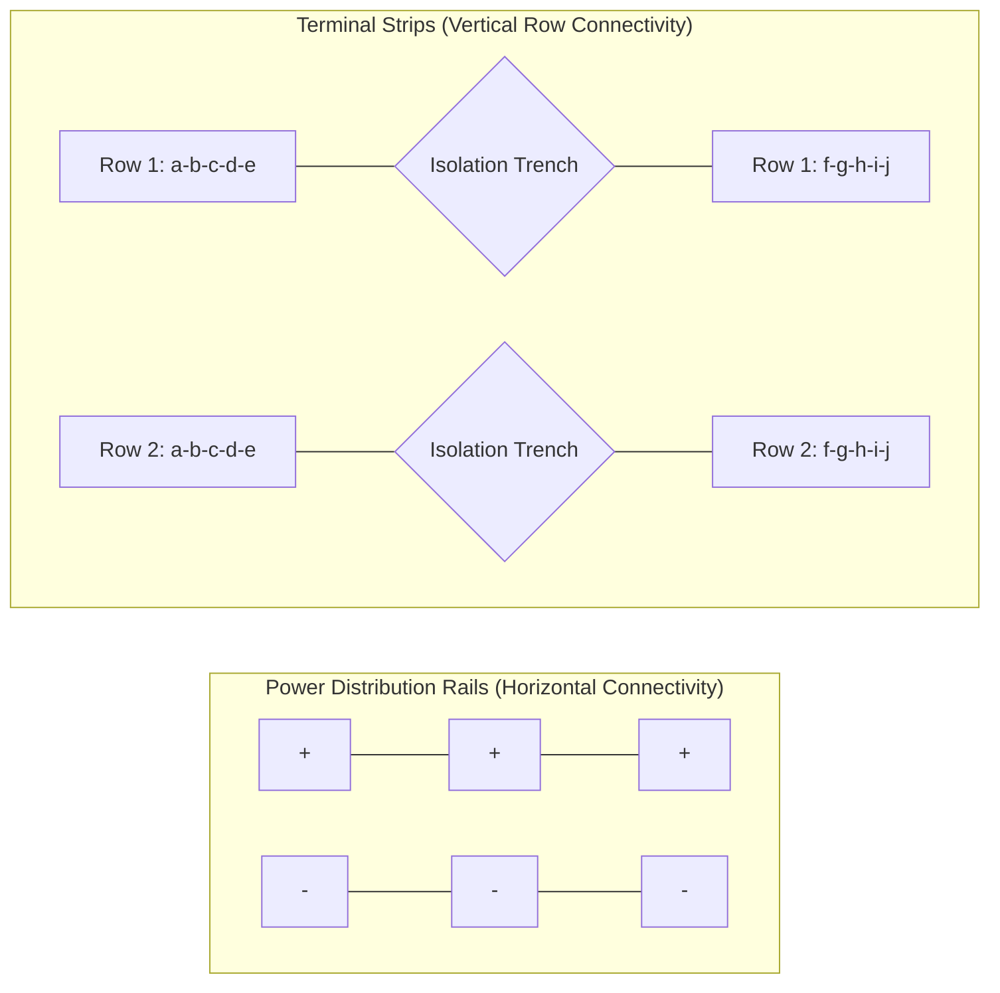
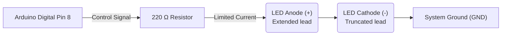

## 3. Digital Output

### Principles of Digital Output
A digital output pin functions as a programmable switch, constrained to two discrete binary states:
- **HIGH (5V logic level)**
- **LOW (0V logic level)**

Digital pins actuate external components such as LEDs, relays, buzzers, and motor drivers.

### Prototyping Board (Breadboard) Architecture
A breadboard facilitates solderless circuit prototyping. Internal conductive clips connect the insertion points (holes) in specific patterns.



**Implementation Note:** Component leads must bridge separate rows to establish a circuit. Inserting both leads into the same row will create a short circuit.

### LED Circuit Implementation
When interfacing an LED, a current-limiting resistor is strictly required.



*Note: LEDs exhibit polarity. The anode must connect toward the positive potential (signal pin), and the cathode toward ground. Incorrect orientation prevents conduction.*

### Standard Library Functions

#### `pinMode()`
Configures the specified pin to behave either as an input or an output. This declaration occurs within the `setup()` block.
```cpp
pinMode(8, OUTPUT); // Configures Pin 8 for signal transmission
```
📚 [Reference: pinMode()](https://docs.arduino.cc/language-reference/en/functions/digital-io/pinMode/)

#### `digitalWrite()`
Assigns a HIGH or LOW state to a digital pin.
```cpp
digitalWrite(8, HIGH); // Engages 5V potential
digitalWrite(8, LOW);  // Dissipates to 0V
```
📚 [Reference: digitalWrite()](https://docs.arduino.cc/language-reference/en/functions/digital-io/digitalWrite/)

#### `delay()`
Suspends processor execution for a specified duration, defined in milliseconds. No subsequent instructions execute during this period.
```cpp
delay(1000); // Suspends execution for 1000 milliseconds (1.0 seconds)
```
📚 [Reference: delay()](https://docs.arduino.cc/language-reference/en/functions/time/delay/)

### State Oscillation Implementation (Blink)
```cpp
int ledPin = 8; // Variable declaration for pin assignment

void setup() {
  pinMode(ledPin, OUTPUT);
}

void loop() {
  digitalWrite(ledPin, HIGH); // Illuminate LED
  delay(1000);                // Maintain state for 1 second
  digitalWrite(ledPin, LOW);  // Extinguish LED
  delay(1000);                // Maintain state for 1 second
}
```

### Variable Declaration
Variables allocate memory for data storage. Utilizing named variables enhances code readability and parameter modification efficiency.
```cpp
int ledPin = 8;         // Integer declaration
bool isOn = true;       // Boolean declaration
long delayTime = 500;   // Extended integer declaration
```

### Task 1: Blink Implementation
**Estimated Duration:** ~15 minutes

- [ ] Construct the LED circuit adhering to the schematic (Pin 8 -> Resistor -> LED -> GND).
- [ ] Initialize the Arduino IDE and input the provided source code.
- [ ] Configure the target board and port interface via the **Tools** menu.
- [ ] Compile and deploy the software via **Upload**.
- [ ] Verify an oscillation frequency of 0.5 Hz (1 second HIGH, 1 second LOW).

**Advanced Exercises:**
- Modify the duty cycle to increase the oscillation frequency by a factor of two.
- Implement an SOS distress pattern sequence manually, omitting iterative loops.
