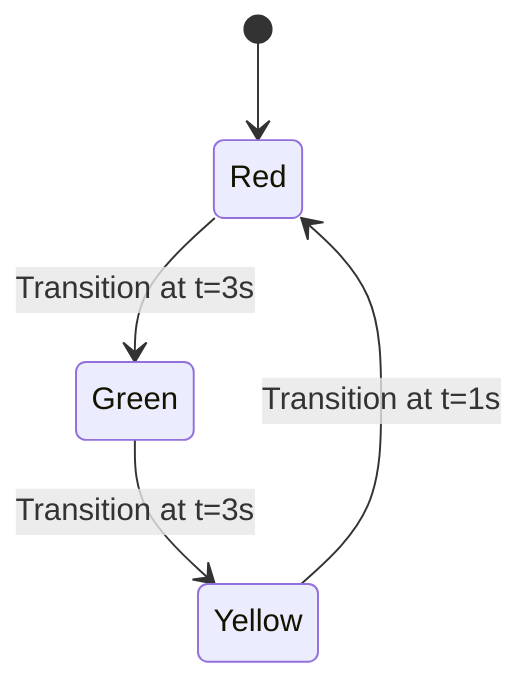
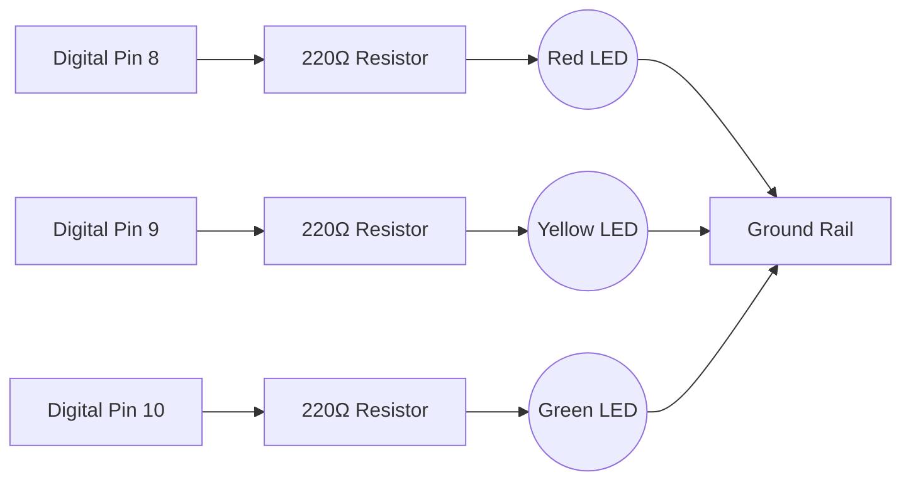

## 4. Sequential Timing Systems (Traffic Light)

Varying temporal states establishes functional sequences. A traffic management system relies on sequential `digitalWrite` and `delay` executions to enforce state transitions.



**Schematic Diagram:**


**Implementation Architecture:**
```cpp
int red = 8, yellow = 9, green = 10;

void setup() {
  pinMode(red, OUTPUT);
  pinMode(yellow, OUTPUT);
  pinMode(green, OUTPUT);
}

void loop() {
  // Implement state transitions:
  // Red HIGH -> Delay -> Red LOW -> Green HIGH -> Delay...
}
```

<details>
<summary>Solution Reference</summary>

```cpp
int red = 8, yellow = 9, green = 10;

void setup() {
  pinMode(red, OUTPUT);
  pinMode(yellow, OUTPUT);
  pinMode(green, OUTPUT);
}

void loop() {
  digitalWrite(red, HIGH);
  delay(3000);
  digitalWrite(red, LOW);

  digitalWrite(green, HIGH);
  delay(3000);
  digitalWrite(green, LOW);

  digitalWrite(yellow, HIGH);
  delay(1000);
  digitalWrite(yellow, LOW);
}
```
Students are encouraged to attempt the implementation independently before reviewing the provided solution.
</details>

### Task 2: Traffic Light Implementation
**Estimated Duration:** ~20 minutes

- [ ] Integrate three independent LED circuits utilizing 220Ω resistors.
- [ ] Program the sequence corresponding to standard traffic light transitions.
- [ ] Implement the timing parameters: Red (3s), Green (3s), Yellow (1s).
- [ ] Deploy the code and verify continuous cyclic operation.

**Advanced Exercise:**
- Implement a precautionary "blinking yellow" state preceding the transition to red.

### Knowledge Verification
<details>
<summary>Why does an LED necessitate a current-limiting resistor, whereas integrated modules (e.g., relays) generally do not?</summary>

An LED is a standard semiconductor diode lacking significant internal resistance; consequently, it cannot regulate current draw and will experience catastrophic failure if unmitigated. Integrated modules inherently contain onboard protection and current-limiting circuitry, negating the requirement for external series resistors.
</details>
