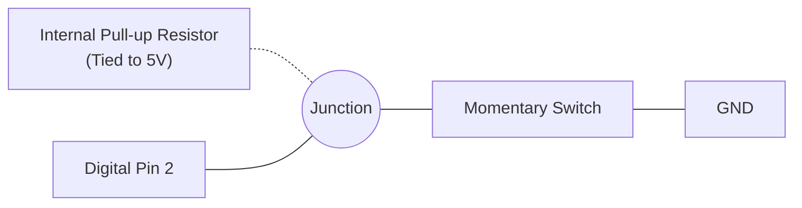
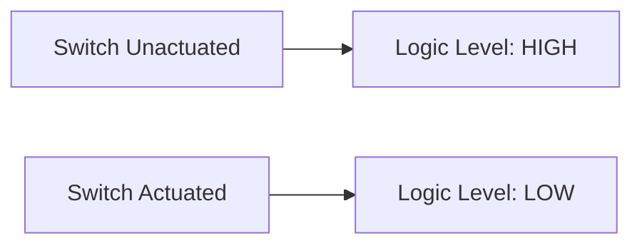

## 5. Digital Input

### Principles of Digital Input
In input mode, the microcontroller analyzes external signal logic levels. A digital input pin registers a boolean state (`HIGH` or `LOW`) based on applied voltage. Applications include tactile switches, proximity sensors, and digital interfaces.

### Switch Circuit Implementation

- The switch bridges across the isolation trench of the breadboard.
- One terminal connects to the target digital pin.
- The opposing terminal connects to systemic ground (GND).
- **Note:** An external pull-up resistor is omitted in favor of the microcontroller's internal hardware.

### Internal Pull-Up Resistors
**Issue:** An unconnected ("floating") input terminal is highly susceptible to electromagnetic interference, resulting in stochastic state fluctuations rather than a defined boolean value.

**Resolution:** The `INPUT_PULLUP` parameter engages an internal resistor linked to the 5V rail, ensuring the pin defaults to a stable logic HIGH state.

**Logic Inversion:** Consequently, the unactuated state reads `HIGH`, while actuation forces a connection to ground, reading `LOW`.
```cpp
pinMode(2, INPUT_PULLUP);
```



### Function: `digitalRead()`
Evaluates and returns the instantaneous logic state of a specified pin.
```cpp
int state = digitalRead(2);
if (state == LOW) {
  // Actuation detected
}
```
📚 [Reference: digitalRead()](https://docs.arduino.cc/language-reference/en/functions/digital-io/digitalRead/)

### Integrated Input/Output Implementation
```cpp
int buttonPin = 2;
int ledPin = 8;

void setup() {
  pinMode(buttonPin, INPUT_PULLUP);
  pinMode(ledPin, OUTPUT);
}

void loop() {
  int state = digitalRead(buttonPin);
  if (state == LOW) {
    digitalWrite(ledPin, HIGH); // Switch actuated; engage LED
  } else {
    digitalWrite(ledPin, LOW);  // Switch unactuated; disengage LED
  }
}
```

### Task 3: Switch-Actuated Output
**Estimated Duration:** ~15 minutes

- [ ] Construct the switch circuit on digital pin 2 connecting to ground.
- [ ] Retain the LED circuit on digital pin 8.
- [ ] Compile and deploy the integrated I/O code.
- [ ] Verify that LED illumination corresponds strictly to switch actuation.

**Advanced Exercise:**
- Modify the logic to implement a state toggle (i.e., sequential presses alternate the LED state between ON and OFF). *Hint: Requires state retention variables and edge-detection logic to prevent continuous toggling during prolonged actuation.*

### Knowledge Verification
<details>
<summary>What systemic behavior is expected if the INPUT_PULLUP parameter is omitted and the pin remains floating?</summary>

The LED will exhibit high-frequency oscillation and erratic behavior. The floating pin lacks a reference voltage and will interpret ambient electromagnetic noise as rapid alternations between HIGH and LOW logic states.
</details>
