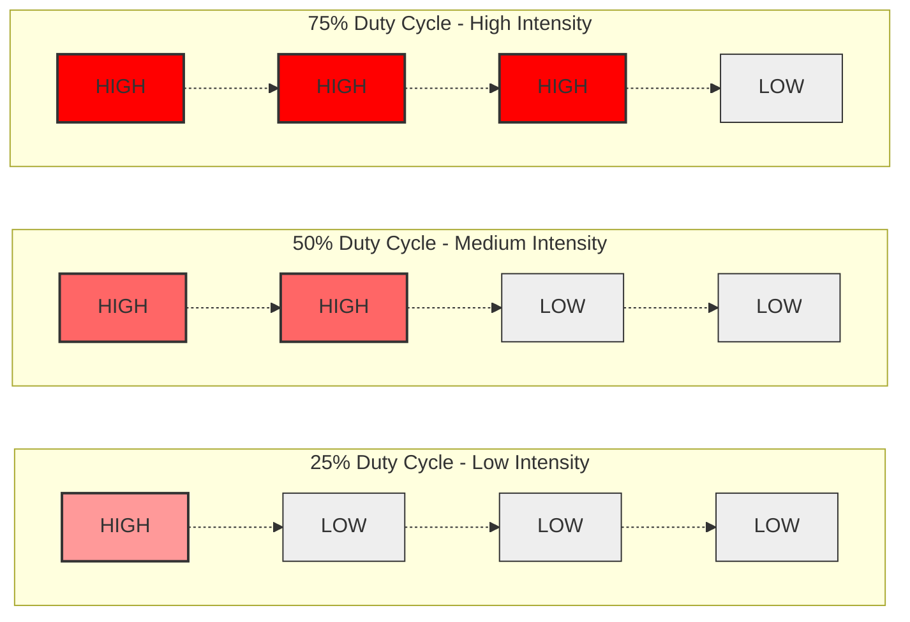

## 6. Pulse Width Modulation (PWM)

### Principles of PWM
Standard digital pins provide discrete binary output. Pulse Width Modulation (PWM) simulates analog variance by rapidly oscillating the binary state. The **duty cycle** represents the percentage of time the signal remains in the HIGH state within a given period.

<video controls loop muted autoplay style="width: 100%; max-width: 800px; border-radius: 8px; margin: 2rem 0;">
  <source src="/videos/pwm_explanation.mp4" type="video/mp4" />
  Your browser does not support the video tag.
</video>



This oscillation occurs at a frequency exceeding human visual perception (~490 Hz or 980 Hz), resulting in the optical illusion of variable luminance.

**PWM Characteristics:**
- Represents an average voltage rather than a true continuous analog waveform.
- Arduino Uno supports hardware PWM exclusively on pins denoted by the `~` prefix (Pins 3, 5, 6, 9, 10, 11).

### Function: `analogWrite()`
Modulates the duty cycle of a specified PWM-capable pin.
```cpp
analogWrite(9, 128); // Value range: 0 (0% duty cycle) to 255 (100% duty cycle)
```
📚 [Reference: analogWrite()](https://docs.arduino.cc/language-reference/en/functions/analog-io/analogWrite/)

### Variable Intensity Implementation
Utilize the standard LED circuit interfaced with a PWM-compatible pin (e.g., Pin 9).

```cpp
int brightness = 0;

void setup() {
  pinMode(9, OUTPUT);
}

void loop() {
  analogWrite(9, brightness);
  brightness = brightness + 5;
  
  if (brightness > 255) {
    brightness = 0;
  }
  
  delay(30); // 30-millisecond execution suspension
}
```

### Task 4: PWM Implementation
**Estimated Duration:** ~15 minutes

- [ ] Reallocate the LED control circuit to a PWM-capable pin.
- [ ] Compile and deploy the variable intensity program.
- [ ] Verify a linear increase in luminosity followed by a discrete reset to zero.

**Advanced Exercise:**
- Modify the logic to implement a bidirectional, continuous fade algorithm (triangular waveform) utilizing a directional state variable.

### Knowledge Verification
<details>
<summary>Why does the provided algorithm exhibit a discontinuous reset rather than a gradual decline in intensity?</summary>

The variable `brightness` is strictly incremented. The conditional boundary check `if (brightness > 255)` reinitializes the variable to zero instantaneously. A continuous fade requires a state flag to dictate whether the loop should execute an increment or decrement operation based on the boundary conditions.
</details>
