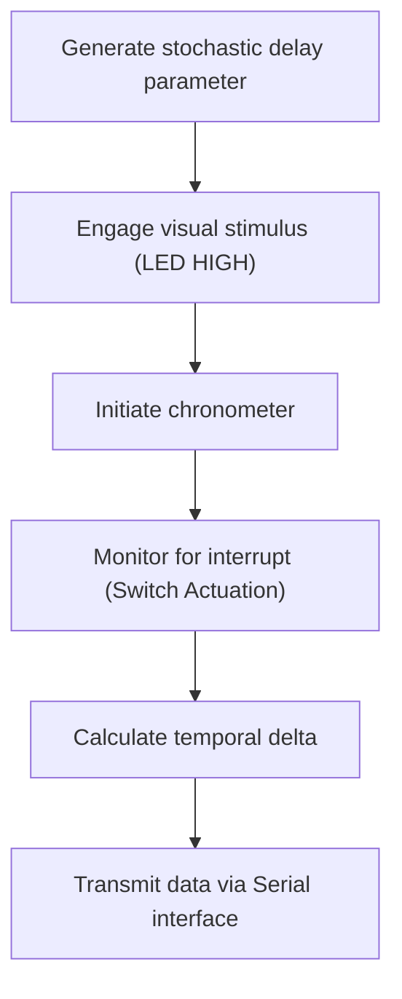

## 7. Extended Implementation Projects

Select one of the following architectural exercises for further application of the core concepts.

### System 1: Interactive Illumination (Night Lamp)
- Integrate the PWM fade algorithm with digital input control.
- Actuation of the switch initiates system operation.
- Implement an extended fade coefficient for gradual illumination.

<details>
<summary>Solution Reference</summary>

```cpp
int buttonPin = 2;
int ledPin = 9; // PWM capable pin
int brightness = 0;

void setup() {
  pinMode(buttonPin, INPUT_PULLUP);
  pinMode(ledPin, OUTPUT);
}

void loop() {
  if (digitalRead(buttonPin) == LOW) {
    if (brightness < 255) {
      brightness += 5;
      delay(30);
    }
  } else {
    if (brightness > 0) {
      brightness -= 5;
      delay(30);
    }
  }
  analogWrite(ledPin, brightness);
}
```
</details>

### System 2: Programmatic Signaling (Morse Code)
- Design sequential logic utilizing defined temporal delays to transmit characters.
- Short duration (dot): ~200 ms; Long duration (dash): ~600 ms.
- Encode a specific string value (e.g., "HI").

**Standard Morse Code Mapping:**

| Letter | Code | Letter | Code | Letter | Code |
|:---:|:---|:---:|:---|:---:|:---|
| **A** | `.-` | **J** | `.---` | **S** | `...` |
| **B** | `-...` | **K** | `-.-` | **T** | `-` |
| **C** | `-.-.` | **L** | `.-..` | **U** | `..-` |
| **D** | `-..` | **M** | `--` | **V** | `...-` |
| **E** | `.` | **N** | `-.` | **W** | `.--` |
| **F** | `..-.` | **O** | `---` | **X** | `-..-` |
| **G** | `--.` | **P** | `.--.` | **Y** | `-.--` |
| **H** | `....` | **Q** | `--.-` | **Z** | `--..` |
| **I** | `..` | **R** | `.-.` | | |

*Example output for "HI": `....` `..` (four short pulses, interval, two short pulses)*

<details>
<summary>Solution Reference</summary>

```cpp
int ledPin = 8;
int dotDelay = 200;
int dashDelay = 600;

void setup() {
  pinMode(ledPin, OUTPUT);
}

void dot() {
  digitalWrite(ledPin, HIGH);
  delay(dotDelay);
  digitalWrite(ledPin, LOW);
  delay(dotDelay); // space between parts of the same letter
}

void dash() {
  digitalWrite(ledPin, HIGH);
  delay(dashDelay);
  digitalWrite(ledPin, LOW);
  delay(dotDelay); // space between parts of the same letter
}

void loop() {
  // Transmit "H" (....)
  dot(); dot(); dot(); dot();
  delay(dashDelay); // Letter gap
  
  // Transmit "I" (..)
  dot(); dot();
  delay(2000); // Word gap
}
```
</details>

### System 3: Chronometric Evaluation (Reaction Timer)

This project requires outputting diagnostic data (the reaction time) from the Arduino back to your computer. This is achieved using the **Serial Interface**.

#### Serial Communication Basics
The microcontroller communicates with the computer via the USB cable using the Serial protocol. To view this data, you use the **Serial Monitor** (accessible via the magnifying glass icon in the top right of the Arduino IDE).

- `Serial.begin(9600);` — Must be called in `setup()` to initialize communication at a specific baud rate (9600 bits per second is standard).
- `Serial.print("Time: ");` — Transmits text or variable data to the computer without a line break.
- `Serial.println(timeElapsed);` — Transmits data followed by a carriage return (moves to the next line).



<details>
<summary>Solution Reference</summary>

```cpp
int buttonPin = 2;
int ledPin = 8;
unsigned long startTime;
bool waitingForReaction = false;

void setup() {
  pinMode(buttonPin, INPUT_PULLUP);
  pinMode(ledPin, OUTPUT);
  Serial.begin(9600);
  randomSeed(analogRead(0)); // Seed random generator with unconnected pin
}

void loop() {
  if (!waitingForReaction) {
    long randomDelay = random(2000, 6000); // Wait 2-6 seconds
    delay(randomDelay);
    
    digitalWrite(ledPin, HIGH);
    startTime = millis();
    waitingForReaction = true;
  }
  
  if (waitingForReaction && digitalRead(buttonPin) == LOW) {
    unsigned long reactionTime = millis() - startTime;
    digitalWrite(ledPin, LOW);
    
    Serial.print("Reaction Time: ");
    Serial.print(reactionTime);
    Serial.println(" ms");
    
    waitingForReaction = false;
    delay(2000); // Pause before next round
  }
}
```
</details>
