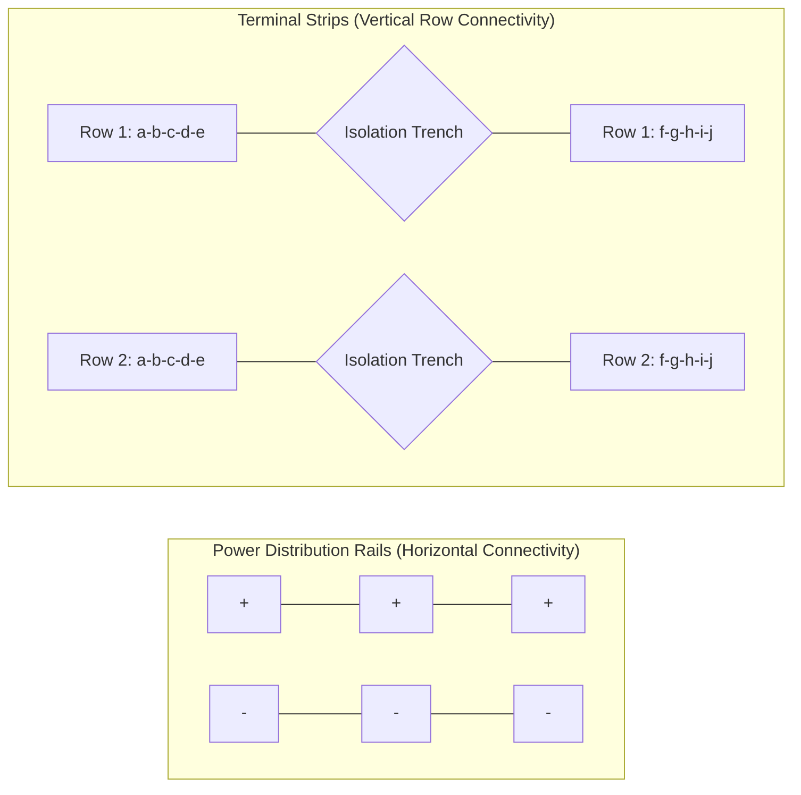
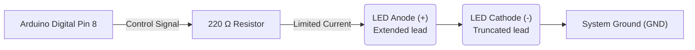
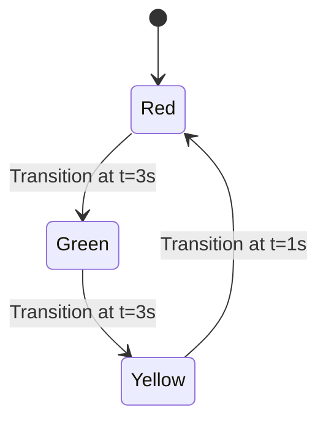
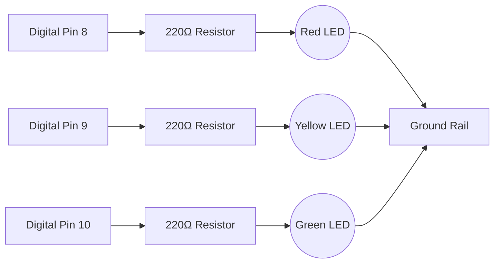
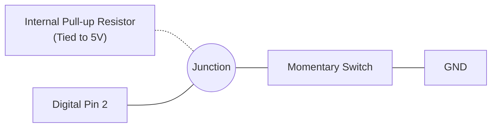
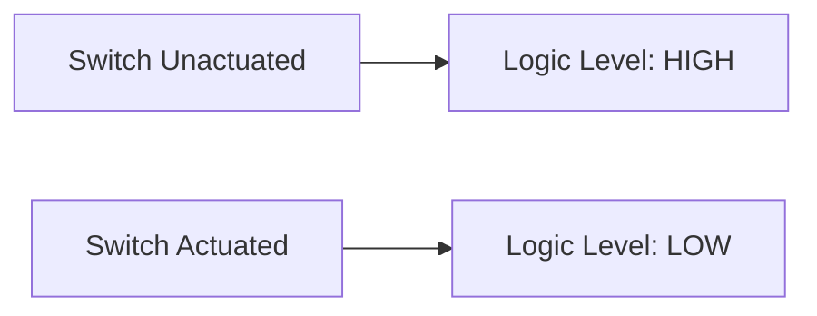
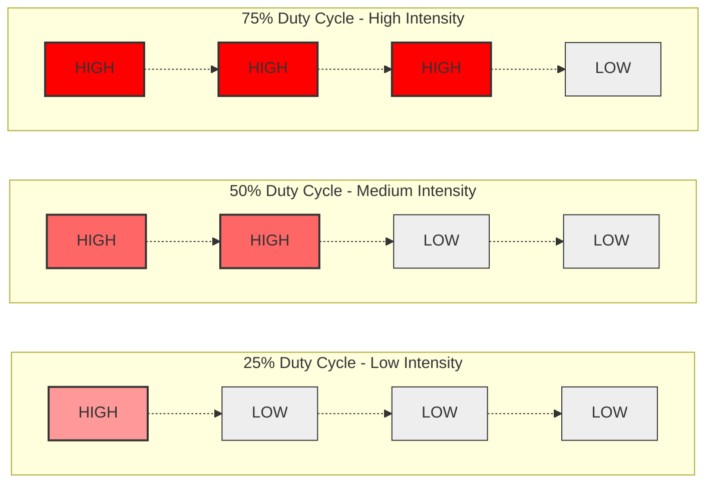
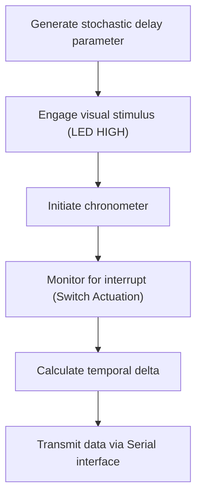

## 1. Introduction

This module focuses on the fundamentals of Arduino microcontroller programming, digital Input/Output (I/O), and Pulse Width Modulation (PWM). By the culmination of this session, students will utilize these concepts to construct functional circuits, including a sequence-timed traffic light.

[Download the Introduction to Hardware Presentation (PDF)](/files/intro2hardware.pdf)

**Target Audience:** This guide assumes foundational knowledge of basic electronics, circuitry, and breadboarding. While these prerequisites are already understood by the audience, introductory electrical theory and breadboard schematics are included throughout this document as supplementary reference material.

### Required Components

| Item | Quantity | Notes |
|---|---|---|
| Arduino Uno (or compatible) | 1 | Microcontroller board |
| USB cable | 1 | Communication interface |
| Breadboard | 1 | Half-size or full-size prototype board |
| LEDs (red, yellow, green) | 1 each | Standard 5mm Light Emitting Diodes |
| 220 Ω resistors | 3 | Color code: red-red-brown-gold |
| Pushbutton | 1 | Standard tactile switch |
| Jumper wires | ~10 | Male-to-male connection wires |
| Arduino IDE | - | [Download link](https://www.arduino.cc/en/software) |

**Note on Simulation:** For students without physical hardware, refer to [Section 8: Simulation Tools](#8-simulation-tools) to model and execute all circuits virtually.

### Contents
1. [Theoretical Foundations](#1-theoretical-foundations)
2. [Anatomy of an Arduino Program](#2-anatomy-of-an-arduino-program)
3. [Digital Output](#3-digital-output)
4. [Sequential Timing Systems](#4-sequential-timing-systems-traffic-light)
5. [Digital Input](#5-digital-input)
6. [Pulse Width Modulation (PWM)](#6-pulse-width-modulation-pwm)
7. [Extended Implementation Projects](#7-extended-implementation-projects)
8. [Simulation Tools](#8-simulation-tools)
9. [Reference Material](#9-reference-material)
10. [Hardware Diagnostic Matrix](#10-hardware-diagnostic-matrix)

---

## 1. Theoretical Foundations (Reference)

The following fundamental electrical properties and calculations are provided as a quick reference.

| Term | Definition | Standard Unit |
|---|---|---|
| **Voltage (V)** | The electrical potential difference driving charge through a circuit. | Volts (V) |
| **Current (I)** | The rate of flow of electric charge. | Amperes (A) |
| **Resistance (R)** | The opposition to current flow within a conductor or component. | Ohms (Ω) |

**Fluid Analogy:** Voltage is analogous to water pressure, current to the volumetric flow rate, and resistance to the constriction of a pipe. Increased resistance proportionally reduces current for a constant voltage.

The relationship between these properties is defined by **Ohm's Law**:

```
V = I × R
```

**Application to LEDs:** A Light Emitting Diode (LED) possesses minimal internal resistance. If connected directly to a 5V source, it will draw excessive current and undergo thermal failure. A resistor placed in series limits the current to operational parameters.

**Calculating Current-Limiting Resistor Values:**
A standard red LED typically requires a forward voltage of ~2V and operates efficiently at 15-20 mA (0.015-0.020 A).

```
R = (Supply Voltage - LED Forward Voltage) / Desired Current
R = (5V - 2V) / 0.015A
R ≈ 200 Ω  (Standard commercially available value: 220 Ω)
```
Consequently, all LED circuits in this module incorporate a 220 Ω series resistor.

---

## 2. Anatomy of an Arduino Program

An Arduino program, conventionally referred to as a **sketch**, mandates the implementation of two primary structural functions:

```cpp
// Executes once upon initialization or reset
void setup() {
  // Initialization parameters
}

// Executes continuously following setup completion
void loop() {
  // Primary operational logic
}
```

**Execution Flow Diagram:**

```mermaid
flowchart TD
    A["Power Initialization / Hardware Reset"] --> B["setup&#40;&#41; Execution - Singular"]
    B --> C["loop&#40;&#41; Initiation"]
    C --> D["Sequential Execution of loop&#40;&#41; Instructions"]
    D --> C
```



The `setup()` function is utilized for hardware configuration, such as defining pin modes. The `loop()` function contains the primary execution logic, which iterates indefinitely at the microcontroller's clock speed.

---

## 3. Digital Output

### Principles of Digital Output
A digital output pin functions as a programmable switch, constrained to two discrete binary states:
- **HIGH (5V logic level)**
- **LOW (0V logic level)**

Digital pins actuate external components such as LEDs, relays, buzzers, and motor drivers.

### Prototyping Board (Breadboard) Architecture
A breadboard facilitates solderless circuit prototyping. Internal conductive clips connect the insertion points (holes) in specific patterns.



**Implementation Note:** Component leads must bridge separate rows to establish a circuit. Inserting both leads into the same row will create a short circuit.

### LED Circuit Implementation
When interfacing an LED, a current-limiting resistor is strictly required.



*Note: LEDs exhibit polarity. The anode must connect toward the positive potential (signal pin), and the cathode toward ground. Incorrect orientation prevents conduction.*

### Standard Library Functions

#### `pinMode()`
Configures the specified pin to behave either as an input or an output. This declaration occurs within the `setup()` block.
```cpp
pinMode(8, OUTPUT); // Configures Pin 8 for signal transmission
```
📚 [Reference: pinMode()](https://docs.arduino.cc/language-reference/en/functions/digital-io/pinMode/)

#### `digitalWrite()`
Assigns a HIGH or LOW state to a digital pin.
```cpp
digitalWrite(8, HIGH); // Engages 5V potential
digitalWrite(8, LOW);  // Dissipates to 0V
```
📚 [Reference: digitalWrite()](https://docs.arduino.cc/language-reference/en/functions/digital-io/digitalWrite/)

#### `delay()`
Suspends processor execution for a specified duration, defined in milliseconds. No subsequent instructions execute during this period.
```cpp
delay(1000); // Suspends execution for 1000 milliseconds (1.0 seconds)
```
📚 [Reference: delay()](https://docs.arduino.cc/language-reference/en/functions/time/delay/)

### State Oscillation Implementation (Blink)
```cpp
int ledPin = 8; // Variable declaration for pin assignment

void setup() {
  pinMode(ledPin, OUTPUT);
}

void loop() {
  digitalWrite(ledPin, HIGH); // Illuminate LED
  delay(1000);                // Maintain state for 1 second
  digitalWrite(ledPin, LOW);  // Extinguish LED
  delay(1000);                // Maintain state for 1 second
}
```

### Variable Declaration
Variables allocate memory for data storage. Utilizing named variables enhances code readability and parameter modification efficiency.
```cpp
int ledPin = 8;         // Integer declaration
bool isOn = true;       // Boolean declaration
long delayTime = 500;   // Extended integer declaration
```

### Task 1: Blink Implementation
**Estimated Duration:** ~15 minutes

- [ ] Construct the LED circuit adhering to the schematic (Pin 8 -> Resistor -> LED -> GND).
- [ ] Initialize the Arduino IDE and input the provided source code.
- [ ] Configure the target board and port interface via the **Tools** menu.
- [ ] Compile and deploy the software via **Upload**.
- [ ] Verify an oscillation frequency of 0.5 Hz (1 second HIGH, 1 second LOW).

**Advanced Exercises:**
- Modify the duty cycle to increase the oscillation frequency by a factor of two.
- Implement an SOS distress pattern sequence manually, omitting iterative loops.

---

## 4. Sequential Timing Systems (Traffic Light)

Varying temporal states establishes functional sequences. A traffic management system relies on sequential `digitalWrite` and `delay` executions to enforce state transitions.



**Schematic Diagram:**


**Implementation Architecture:**
```cpp
int red = 8, yellow = 9, green = 10;

void setup() {
  pinMode(red, OUTPUT);
  pinMode(yellow, OUTPUT);
  pinMode(green, OUTPUT);
}

void loop() {
  // Implement state transitions:
  // Red HIGH -> Delay -> Red LOW -> Green HIGH -> Delay...
}
```

<details>
<summary>Solution Reference</summary>

```cpp
int red = 8, yellow = 9, green = 10;

void setup() {
  pinMode(red, OUTPUT);
  pinMode(yellow, OUTPUT);
  pinMode(green, OUTPUT);
}

void loop() {
  digitalWrite(red, HIGH);
  delay(3000);
  digitalWrite(red, LOW);

  digitalWrite(green, HIGH);
  delay(3000);
  digitalWrite(green, LOW);

  digitalWrite(yellow, HIGH);
  delay(1000);
  digitalWrite(yellow, LOW);
}
```
Students are encouraged to attempt the implementation independently before reviewing the provided solution.
</details>

### Task 2: Traffic Light Implementation
**Estimated Duration:** ~20 minutes

- [ ] Integrate three independent LED circuits utilizing 220Ω resistors.
- [ ] Program the sequence corresponding to standard traffic light transitions.
- [ ] Implement the timing parameters: Red (3s), Green (3s), Yellow (1s).
- [ ] Deploy the code and verify continuous cyclic operation.

**Advanced Exercise:**
- Implement a precautionary "blinking yellow" state preceding the transition to red.

### Knowledge Verification
<details>
<summary>Why does an LED necessitate a current-limiting resistor, whereas integrated modules (e.g., relays) generally do not?</summary>

An LED is a standard semiconductor diode lacking significant internal resistance; consequently, it cannot regulate current draw and will experience catastrophic failure if unmitigated. Integrated modules inherently contain onboard protection and current-limiting circuitry, negating the requirement for external series resistors.
</details>

---

## 5. Digital Input

### Principles of Digital Input
In input mode, the microcontroller analyzes external signal logic levels. A digital input pin registers a boolean state (`HIGH` or `LOW`) based on applied voltage. Applications include tactile switches, proximity sensors, and digital interfaces.

### Switch Circuit Implementation

- The switch bridges across the isolation trench of the breadboard.
- One terminal connects to the target digital pin.
- The opposing terminal connects to systemic ground (GND).
- **Note:** An external pull-up resistor is omitted in favor of the microcontroller's internal hardware.

### Internal Pull-Up Resistors
**Issue:** An unconnected ("floating") input terminal is highly susceptible to electromagnetic interference, resulting in stochastic state fluctuations rather than a defined boolean value.

**Resolution:** The `INPUT_PULLUP` parameter engages an internal resistor linked to the 5V rail, ensuring the pin defaults to a stable logic HIGH state.

**Logic Inversion:** Consequently, the unactuated state reads `HIGH`, while actuation forces a connection to ground, reading `LOW`.
```cpp
pinMode(2, INPUT_PULLUP);
```



### Function: `digitalRead()`
Evaluates and returns the instantaneous logic state of a specified pin.
```cpp
int state = digitalRead(2);
if (state == LOW) {
  // Actuation detected
}
```
📚 [Reference: digitalRead()](https://docs.arduino.cc/language-reference/en/functions/digital-io/digitalRead/)

### Integrated Input/Output Implementation
```cpp
int buttonPin = 2;
int ledPin = 8;

void setup() {
  pinMode(buttonPin, INPUT_PULLUP);
  pinMode(ledPin, OUTPUT);
}

void loop() {
  int state = digitalRead(buttonPin);
  if (state == LOW) {
    digitalWrite(ledPin, HIGH); // Switch actuated; engage LED
  } else {
    digitalWrite(ledPin, LOW);  // Switch unactuated; disengage LED
  }
}
```

### Task 3: Switch-Actuated Output
**Estimated Duration:** ~15 minutes

- [ ] Construct the switch circuit on digital pin 2 connecting to ground.
- [ ] Retain the LED circuit on digital pin 8.
- [ ] Compile and deploy the integrated I/O code.
- [ ] Verify that LED illumination corresponds strictly to switch actuation.

**Advanced Exercise:**
- Modify the logic to implement a state toggle (i.e., sequential presses alternate the LED state between ON and OFF). *Hint: Requires state retention variables and edge-detection logic to prevent continuous toggling during prolonged actuation.*

### Knowledge Verification
<details>
<summary>What systemic behavior is expected if the INPUT_PULLUP parameter is omitted and the pin remains floating?</summary>

The LED will exhibit high-frequency oscillation and erratic behavior. The floating pin lacks a reference voltage and will interpret ambient electromagnetic noise as rapid alternations between HIGH and LOW logic states.
</details>

---

## 6. Pulse Width Modulation (PWM)

### Principles of PWM
Standard digital pins provide discrete binary output. Pulse Width Modulation (PWM) simulates analog variance by rapidly oscillating the binary state. The **duty cycle** represents the percentage of time the signal remains in the HIGH state within a given period.

<video controls loop muted autoplay style="width: 100%; max-width: 800px; border-radius: 8px; margin: 2rem 0;">
  <source src="/videos/pwm_explanation.mp4" type="video/mp4" />
  Your browser does not support the video tag.
</video>



This oscillation occurs at a frequency exceeding human visual perception (~490 Hz or 980 Hz), resulting in the optical illusion of variable luminance.

**PWM Characteristics:**
- Represents an average voltage rather than a true continuous analog waveform.
- Arduino Uno supports hardware PWM exclusively on pins denoted by the `~` prefix (Pins 3, 5, 6, 9, 10, 11).

### Function: `analogWrite()`
Modulates the duty cycle of a specified PWM-capable pin.
```cpp
analogWrite(9, 128); // Value range: 0 (0% duty cycle) to 255 (100% duty cycle)
```
📚 [Reference: analogWrite()](https://docs.arduino.cc/language-reference/en/functions/analog-io/analogWrite/)

### Variable Intensity Implementation
Utilize the standard LED circuit interfaced with a PWM-compatible pin (e.g., Pin 9).

```cpp
int brightness = 0;

void setup() {
  pinMode(9, OUTPUT);
}

void loop() {
  analogWrite(9, brightness);
  brightness = brightness + 5;
  
  if (brightness > 255) {
    brightness = 0;
  }
  
  delay(30); // 30-millisecond execution suspension
}
```

### Task 4: PWM Implementation
**Estimated Duration:** ~15 minutes

- [ ] Reallocate the LED control circuit to a PWM-capable pin.
- [ ] Compile and deploy the variable intensity program.
- [ ] Verify a linear increase in luminosity followed by a discrete reset to zero.

**Advanced Exercise:**
- Modify the logic to implement a bidirectional, continuous fade algorithm (triangular waveform) utilizing a directional state variable.

### Knowledge Verification
<details>
<summary>Why does the provided algorithm exhibit a discontinuous reset rather than a gradual decline in intensity?</summary>

The variable `brightness` is strictly incremented. The conditional boundary check `if (brightness > 255)` reinitializes the variable to zero instantaneously. A continuous fade requires a state flag to dictate whether the loop should execute an increment or decrement operation based on the boundary conditions.
</details>

---

## 7. Extended Implementation Projects

Select one of the following architectural exercises for further application of the core concepts.

### System 1: Interactive Illumination (Night Lamp)
- Integrate the PWM fade algorithm with digital input control.
- Actuation of the switch initiates system operation.
- Implement an extended fade coefficient for gradual illumination.

<details>
<summary>Solution Reference</summary>

```cpp
int buttonPin = 2;
int ledPin = 9; // PWM capable pin
int brightness = 0;

void setup() {
  pinMode(buttonPin, INPUT_PULLUP);
  pinMode(ledPin, OUTPUT);
}

void loop() {
  if (digitalRead(buttonPin) == LOW) {
    if (brightness < 255) {
      brightness += 5;
      delay(30);
    }
  } else {
    if (brightness > 0) {
      brightness -= 5;
      delay(30);
    }
  }
  analogWrite(ledPin, brightness);
}
```
</details>

### System 2: Programmatic Signaling (Morse Code)
- Design sequential logic utilizing defined temporal delays to transmit characters.
- Short duration (dot): ~200 ms; Long duration (dash): ~600 ms.
- Encode a specific string value (e.g., "HI").

**Standard Morse Code Mapping:**

| Letter | Code | Letter | Code | Letter | Code |
|:---:|:---|:---:|:---|:---:|:---|
| **A** | `.-` | **J** | `.---` | **S** | `...` |
| **B** | `-...` | **K** | `-.-` | **T** | `-` |
| **C** | `-.-.` | **L** | `.-..` | **U** | `..-` |
| **D** | `-..` | **M** | `--` | **V** | `...-` |
| **E** | `.` | **N** | `-.` | **W** | `.--` |
| **F** | `..-.` | **O** | `---` | **X** | `-..-` |
| **G** | `--.` | **P** | `.--.` | **Y** | `-.--` |
| **H** | `....` | **Q** | `--.-` | **Z** | `--..` |
| **I** | `..` | **R** | `.-.` | | |

*Example output for "HI": `....` `..` (four short pulses, interval, two short pulses)*

<details>
<summary>Solution Reference</summary>

```cpp
int ledPin = 8;
int dotDelay = 200;
int dashDelay = 600;

void setup() {
  pinMode(ledPin, OUTPUT);
}

void dot() {
  digitalWrite(ledPin, HIGH);
  delay(dotDelay);
  digitalWrite(ledPin, LOW);
  delay(dotDelay); // space between parts of the same letter
}

void dash() {
  digitalWrite(ledPin, HIGH);
  delay(dashDelay);
  digitalWrite(ledPin, LOW);
  delay(dotDelay); // space between parts of the same letter
}

void loop() {
  // Transmit "H" (....)
  dot(); dot(); dot(); dot();
  delay(dashDelay); // Letter gap
  
  // Transmit "I" (..)
  dot(); dot();
  delay(2000); // Word gap
}
```
</details>

### System 3: Chronometric Evaluation (Reaction Timer)

This project requires outputting diagnostic data (the reaction time) from the Arduino back to your computer. This is achieved using the **Serial Interface**.

#### Serial Communication Basics
The microcontroller communicates with the computer via the USB cable using the Serial protocol. To view this data, you use the **Serial Monitor** (accessible via the magnifying glass icon in the top right of the Arduino IDE).

- `Serial.begin(9600);` — Must be called in `setup()` to initialize communication at a specific baud rate (9600 bits per second is standard).
- `Serial.print("Time: ");` — Transmits text or variable data to the computer without a line break.
- `Serial.println(timeElapsed);` — Transmits data followed by a carriage return (moves to the next line).



<details>
<summary>Solution Reference</summary>

```cpp
int buttonPin = 2;
int ledPin = 8;
unsigned long startTime;
bool waitingForReaction = false;

void setup() {
  pinMode(buttonPin, INPUT_PULLUP);
  pinMode(ledPin, OUTPUT);
  Serial.begin(9600);
  randomSeed(analogRead(0)); // Seed random generator with unconnected pin
}

void loop() {
  if (!waitingForReaction) {
    long randomDelay = random(2000, 6000); // Wait 2-6 seconds
    delay(randomDelay);
    
    digitalWrite(ledPin, HIGH);
    startTime = millis();
    waitingForReaction = true;
  }
  
  if (waitingForReaction && digitalRead(buttonPin) == LOW) {
    unsigned long reactionTime = millis() - startTime;
    digitalWrite(ledPin, LOW);
    
    Serial.print("Reaction Time: ");
    Serial.print(reactionTime);
    Serial.println(" ms");
    
    waitingForReaction = false;
    delay(2000); // Pause before next round
  }
}
```
</details>

---

## 8. Simulation Tools

For development and verification without physical hardware, the following browser-based environments provide accurate hardware modeling and execution capability.

| Platform | Core Utility | Documentation URI |
|---|---|---|
| **Tinkercad Circuits** | Introductory schematic rendering and basic Arduino emulation. | [tinkercad.com/circuits](https://www.tinkercad.com/circuits) |
| **Wokwi** | High-fidelity hardware emulation, advanced IDE integration, and state-sharing features. | [wokwi.com](https://wokwi.com/) |
| **SimulIDE** | Desktop-based, offline analog and digital simulation architecture. | [simulide.com](https://simulide.com/) |
| **Falstad Circuit Simulator** | Pure analog physics emulation (voltage vectors, current flow analysis). | [falstad.com/circuit](https://www.falstad.com/circuit/) |

**Methodological Recommendation:** Prototyping code and schematics within a virtual environment (e.g., Wokwi) prior to physical deployment minimizes syntax and hardware diagnostic overhead.

---

## 9. Reference Material

- [Core Arduino Language Specification](https://docs.arduino.cc/language-reference/)
- [Digital I/O: pinMode()](https://docs.arduino.cc/language-reference/en/functions/digital-io/pinMode/)
- [Digital I/O: digitalWrite()](https://docs.arduino.cc/language-reference/en/functions/digital-io/digitalWrite/)
- [Digital I/O: digitalRead()](https://docs.arduino.cc/language-reference/en/functions/digital-io/digitalRead/)
- [Analog I/O: analogWrite()](https://docs.arduino.cc/language-reference/en/functions/analog-io/analogWrite/)
- [Time: delay()](https://docs.arduino.cc/language-reference/en/functions/time/delay/)
- [Arduino IDE Repository](https://www.arduino.cc/en/software)

---

## 10. Hardware Diagnostic Matrix

| Observation | Probable Root Cause |
|---|---|
| LED fails to illuminate | Polarity inversion (anode/cathode reversed) or incomplete ground continuity. |
| Diminished LED luminosity | Incorrect pin assignment in software versus physical hardware mapping. |
| IDE compilation/upload failure | Incorrect COM port or board architecture selected in the deployment interface. |
| Switch registers continuous actuation | Omission of `INPUT_PULLUP` declaration or incorrect physical bridging of breadboard trench. |
| Sequential states overlap (Traffic Light) | Failure to execute `digitalWrite(LOW)` prior to initiating the subsequent state. |
| PWM algorithm results in discrete blinking | Component interfaced with a standard digital pin rather than a PWM-enabled port (`~`). |

---

## Summary

This module covered the following core concepts:
- **Electrical Theory:** Voltage, Current, Resistance, and Ohm's Law.
- **Microcontroller Basics:** `setup()` and `loop()` architectural structure.
- **Digital Logic (Output):** Actuation utilizing `pinMode` and `digitalWrite`.
- **Digital Logic (Input):** State detection utilizing `digitalRead` and internal pull-up resistors.
- **Signal Modulation:** Simulating analog variance via Pulse Width Modulation (PWM).

Mastery of these fundamental principles forms the basis for all advanced embedded systems engineering.